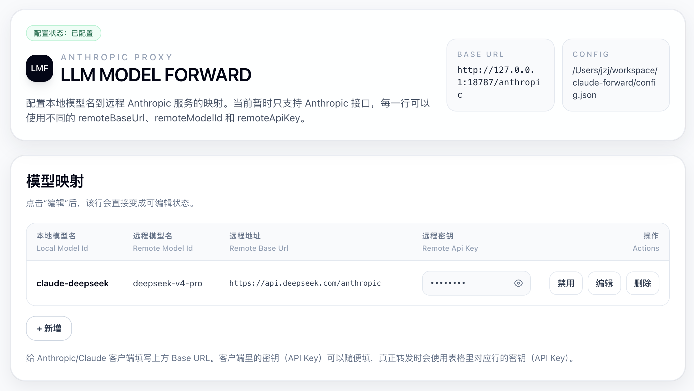

# llm-model-forward

本地大模型 API 转发器。客户端连本机，真实请求按网页配置转发到远程模型服务。当前暂时只支持 Anthropic 接口。

```text
Anthropic/Claude 客户端 -> http://127.0.0.1:18787/anthropic -> 远程模型服务
```



## 安装

### AI Agent 安装（推荐）

普通用户可以把当前项目链接直接发送给 Codex / Claude / OpenClaw 等 Agent 工具安装。

```text
帮我安装这个项目，使用PM2运行 https://github.com/jzj1993/llm-model-forward
```

### 手动安装

```bash
git clone git@github.com:jzj1993/llm-model-forward.git
cd llm-model-forward
npm install
```

## 运行

### 临时运行

```bash
npm start
```

临时运行适合临时使用或测试。关闭终端后服务会停止。

### PM2 持续运行（推荐）

安装 PM2：

```bash
npm install -g pm2
```

后台启动：

```bash
pm2 start ecosystem.config.cjs
```

常用命令：

```bash
pm2 status llm-model-forward
pm2 logs llm-model-forward
pm2 restart llm-model-forward
pm2 stop llm-model-forward
pm2 delete llm-model-forward
```

开机自启：

```bash
pm2 save
pm2 startup
```

`pm2 startup` 会输出一条需要复制执行的命令，照着执行一次即可。

## 本工具配置

### 网页后台配置（推荐）

**普通用户建议只用网页改配置。**

<http://127.0.0.1:18787>

在网页中点“新增”按钮，按网页中的提示设置即可。其中：

- 远程模型参数，填写真实的大模型信息，例如 DeepSeek
- 本地模型名可以任意填写，对于 Claude Desktop / Cowork App 场景，需要填 `claude` 开头的名字。
- 如果有多个不同的大模型提供商、模型，可以都填上。

### 配置文件

配置文件：项目目录下的 `config.json`，不存在会自动创建。

格式：

```json
{
  "listen": {
    "host": "127.0.0.1",
    "port": 18787
  },
  "debug": false,
  "models": [
    {
      "localModelId": "claude-sonnet",
      "remoteModelId": "provider-sonnet",
      "remoteBaseUrl": "https://provider-a.example.com",
      "remoteApiKey": "provider-a-api-key",
      "enabled": true
    }
  ]
}
```

## Claude / Agent 客户端配置

Base URL：

```text
http://127.0.0.1:18787/anthropic
```

客户端密钥（API Key）可以随便填，例如：

```text
local-anything
```

真正发给远程模型的密钥（API Key）来自网页配置；网页里没填时，不会向远程模型发送密钥。

模型名称 / Model ID：使用前面在网页中配置的本地模型名称。

## 安全性说明

本项目所有的 API Key 都保存在本地。只会发送给用户配置的大模型接口，不会往任何第三方网站发送。

转发接口时，只有当原始接口中包含了 API Key 字段，才会把 API Key 发给远程大模型接口，避免 API Key 泄露给不相关的接口。

## 开发相关

### 实现思路

- Node.js + Express 提供本地服务，EJS + Tailwind 提供配置页面。
- `/anthropic/*` 会去掉 `/anthropic` 前缀，再转发到对应模型的 `remoteBaseUrl`。
- 请求体里的 `model` 会按配置改成 `remoteModelId`；匹配不到时使用第一条启用的模型配置。
- 如果客户端带了 `x-api-key` 或 `Authorization`，转发时会替换成 `remoteApiKey`；客户端没带鉴权头时不会主动添加。

### 测试

```bash
npm test
```

### 健康检查

```bash
curl http://127.0.0.1:18787/health
```

返回 `{"ok":true,...}` 表示服务在运行。

### 调试日志

默认不写调试日志。需要排查转发失败时，修改 `config.json`：

```json
{
  "debug": true
}
```

重启服务：

```bash
pm2 restart llm-model-forward
```

查看日志：

```bash
tail -f data/llm-model-forward.log
```

日志会记录转发方法、远程模型 URL、远程模型状态码和错误信息；密钥会被隐藏。`data/` 已被 Git 忽略。
